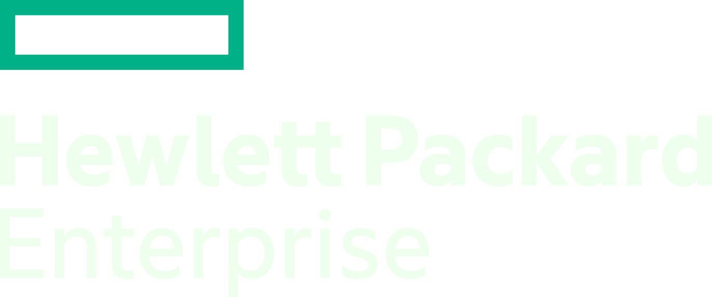
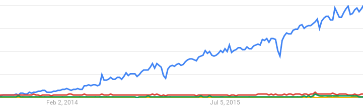
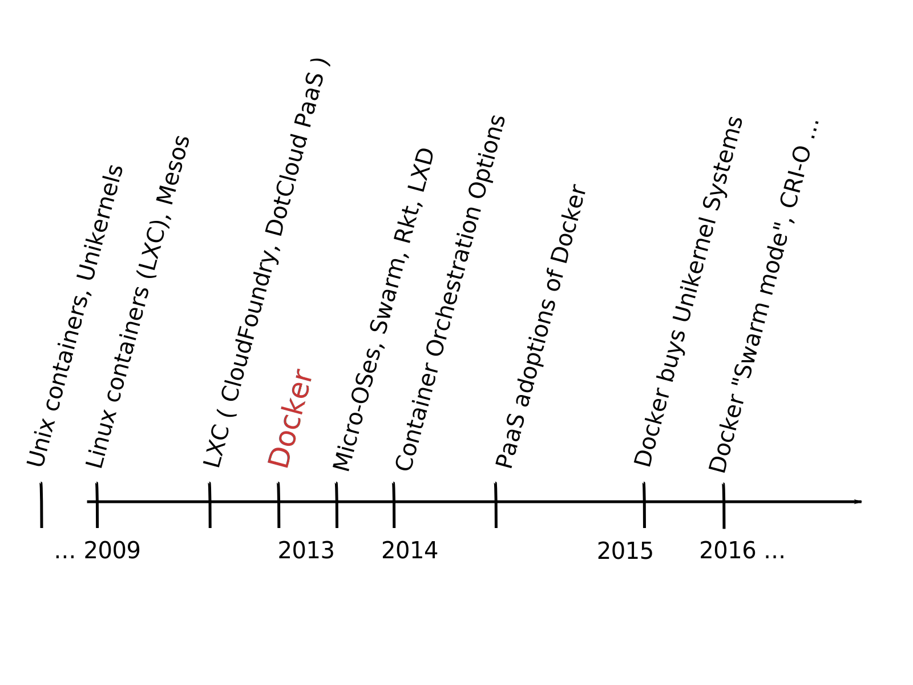
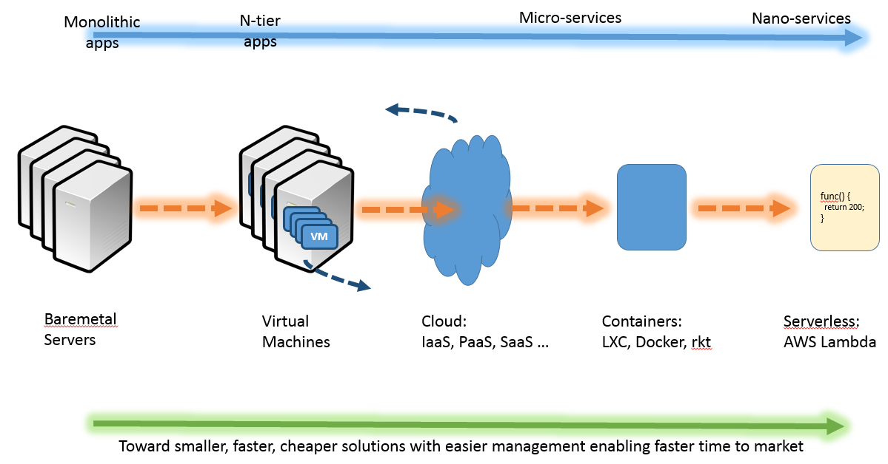

name: title_inversed_whiteText
layout: false
class: center, middle, inverse

##Container Orchestration: The State of Play

###Open Source Summit Europe, Prague, Oct 2017

<br/> <br/> <br/>
<br/> <br/> <br/>
<h3>  &nbsp;&nbsp; &nbsp;&nbsp; &nbsp;&nbsp; Mike Bright,  @mjbright </h3>

<!--
    <h3>  &nbsp;&nbsp;&nbsp;&nbsp;  &nbsp;&nbsp; Haikel Guemar,  @hguemar </h3>
    <h3>  &nbsp;&nbsp; &nbsp;&nbsp; &nbsp;&nbsp; Mario Loriedo,  @mariolet </h3>
-->


???
SpeakerNotes:

Introduce ourselves.

Why this presentation?

Container Orchestration is a hot topic with multiple vendors positioning themselves in this space.

It's not easy to make a choice but the great news is that most of these orchestration engines are Open Source !
In fact all are OpenSource except the hosted versions.
What licenses?

TODO: Replace (many) images with "hand drawn" images (via Wacom or Inkscape?)
      Use Jupyter/matplotlib->svg/%%svg for images, graphs, animations ...

TODO: Take tips from this presn: http://asmeurer.github.io/python3-presentation/slides.html#1
      How does this guy do his titles? http://kjbekkelund.github.io/js-architecture-backbone/#2

This presentation on [github](https://github.com/mjbright/LinuxConEU-ContainerOrchestration) on [ContainerCon Schedule](https://linuxconcontainerconeurope2016.sched.org/event/7oHV/container-orchestration-swarm-mesos-kubernetes-which-conductor-mike-bright-hpe)

Abstract
---------

Oh my, as if we didn’t have enough container choices with LXC, Docker, rkt, LXD, we still have to choose a container orchestrator and there are lots of them !

Worse - the choice of orchestrator is the new industry battleground.
Feature sets increase rapidly and industry players are making acquisitions and investments.

It’s still early days in container orchestration and so existing solutions partially overlap meaning that combinations of orchestrators may be needed.

So how should you choose for your use case?

In this talk we’ll take a look at what is orchestration and why you need it.
We’ll look at the main contenders amongst Docker Swarm, Google’s Kubernetes, Apache Mesos as well as Fleet, Rancher/cattle and Juju.

We’ll compare and contrast the existing solutions, look at where they are heading and how you can use them in your solution today and tomorrow.

I'm not an expert in this fast moving field, but I hope to give you an overview so you better understand the many tools on offer, so you can differentiate between them.

Everything I tell you may be factual today, but will surely be false in a few months as these fast moving projects vie for position.

.footnote[.vlightgray[ @mjbright ]]


---
name: section_history
layout: false
class: center, middle, inverse
## .cyan[First ...]
<!-- .red[ TEST ]  .blue[TEST]  .green[TEST]  .yellow[TEST]  .magenta[TEST]  .cyan[TEST]  .pink[TEST] -->
<!-- .footnote[.green[But lets not forget the alternatives ...]] -->

## .blue[A little bit of history]



???
SpeakerNotes:

No need I'm sure to remind you of Docker's meteoric rise since it's announcement in March 2013.

Although containers existed for quite some time before in various Unices ad Linux (LXC), Docker
popularized the technology by making containers so easy to use and share.

---
layout: false
class: center, middle
exclude: true


So let's first look at recent container history ...



.footnote[.vlightgray[ @mjbright ]]
???
SpeakerNotes:

talk about
- pre-historique containers (Solaris Zones, BSD Jails, HPUX xxx, OpenVZ) starting from ~ 1979 on System 7
- The first Unikernel systems were Exokernel and Nemesis in the late 1990s.
- Linux Containers (LXC) in mainline kernel from 2010
- Then came Docker
  Of course containers existed already, but Docker made them usable
  Of course Docker also did an incredible job marketing their tools
  and inciting developers to adopt and evangelize.

  Docker continue to push boundaries to do complex stuff whilst keeping
  their software simple to use.

  Nevertheless other players wanted more influence and pushed for an open standard.

- PaaS adoption OpenShift CP v3, Stackato v4, Deis (from outset)

- OCI was formed in June 2015.
   https://www.opencontainers.org/
   Docker donated libcontainer code        ==> runC
                  base format (+rkt appc?) ==> OCF

- Alternatives: rkt, LXD, Garden/Guardian(?)
      but Docker has the mindshare and continues to make great progress.
       So although I'm pleased to see alternatives - Open Source alternatives - when I talk about container (engines) I generally consider Docker as a given.

DONE??: image showing "growth" (?) of containers ...
- LXC, Docker, rkt, LXD, runC/OCI, Garden

#### LXC:
http://www.ibm.com/developerworks/library/l-lxc-containers/


---
layout: false
class: center, middle, inverse
    ## The evolution from Monoliths to &mu;-Services

???
SpeakerNotes:

A quite different concept with the same goals of small OS, with small attack surface.

---
layout: false
class: center, middle
    ## From monoliths to &mu;-services




.footnote[.vlightgray[ @mjbright ]]
???
SpeakerNotes:

Remember when **high availability** meant this Active/Standby "Pets"

then N+1 Active/Standby, possibly as part of an 3-tier model with load-balancer in front

then VMs

then containers

we're still waiting for Unikernels,  but they will come for some specialist uses

and now "Serverless" ...

Note that the tendency is to
- remove the burden of managing physical, or even virtual, systems
- have the developer focus on his business logic not the infrastructure
- achieve greater agility to develop, test, deploy, maintain, scale
- less upfront CAPEX investment on hardware
- greater efficiency through mutualisation of resources
-  decomposition of services into &mu;-services
  - micro-services allow to scale components of a service independently - more efficient
  - abstract away the hardware/VMs


Container solutions such as Docker go beyond the isolation capabilities of LXC
by providing simple to use tools to enable packaging of apps with their dependencies allowing
portable applications between systems.

Containers are lightweight

Versioned images containing all dependancies can be shared

Containers allow to use the same application binaries on development, test and production systems whether that be on a laptop, server or in the cloud.

It's a no brainer for developers, who can build and share their own images

---
layout: false
class: center, middle
exclude: true

.left-column[
    ## History
]
.right-column[
## Container-OSes

Vendors are developing Container-OSes, small OS (mainly Linux-based) for container engine hosts (bare-metal or virtual **host machines**).

They're small, fast to boot, use few resources, have a small attack surface and often *"atomic"* software updates.

OS||Vendor
-|-|-
LinuxKit|-|(Docker)
Alpine Linux|-|()
Container Linux|-|(CoreOS)
Project Atomic|-|(RedHat)
RancherOS|-|(Rancher Labs)
Photon|-|(VMWare)
Nano Server OS|-|(Microsoft)
Ubuntu Snappy Core|-|(Canonical)
MicroOS |-|(Suse)

.bold[.green[...Unikernels]]
]

???
SpeakerNotes:
- Container-OSes or lightweight Cloud Servers

- CoreOS             (CoreOS)
- Project Atomic     (RedHat)
- Photon             (VMWare)
- RancherOS          (Rancher Labs)
- Nano Server OS     (Microsoft)
- Ubuntu Snappy Core (Canonical)

Describe the raison d'etre of micro-OSes
- Lightweight OSes - small, including only what's needed
    - SECURITY: small attack surface
- Docker native support (at least), often Kubernetes, ...
    - Support deploying containers across a cluster
- "atomic" updates to OS (CoreOS?): OS is updated as a whole, not package-by-package

RancherOS: interesting use of system and application containers

Mention HPE ContainerOS for The Machine (HPE Linux)

TODO: http://www.lemagit.fr/conseil/Nano-Server-Microsoft-entre-de-plein-pied-dans-le-monde-des-micro-services

Atomic Host not just kernel+docker:
- Kubernetes, systemd, OpenSSH, Storage: NFS, Gluster, ..., cloud-init, SSSD, Networking (NetworkManager, future: +Open vSwitch), Core dump collection (abrt/systemd-coredump)
    Flannel for networking
RPM+OSTree: Atomic host OS upgrades+rollback


---
layout: false
class: center, middle
.left-column[
    ## &mu;-services
]
.right-column[
    ## From monoliths to &mu;-services

But 1000's of instances are **unmanageable** ...

|   |   |
|---|---|
| We can't take care of our pets | , |
| so we have to treat them like cattle |  |

that's cloud native !
]

.footnote[.vlightgray[ @mjbright ]]
???
SpeakerNotes:

Pets - you take care of them when they're ill

Cattle - one dies, you just replace it

This is not to say that you cannot have system containers also ...


---
name: section_coes
layout: false
class: center, middle, inverse
## So we need .cyan[Container Orchestration]


???
SpeakerNotes:

*Viktor Farcic, senior consultant at CloudBees*

A significant change in 2017 will be focused not so much around running containers, but scheduling them inside clusters. Solutions like Docker Swarm, Kubernetes, Mesos, etc. will become mainstream. We will see more solutions that will go beyond simple scheduling. We’ll see the rise of self-healing systems. In 2017, the battle for the “uber orchestrator” will become much more prominent.

- See more at: http://sdtimes.com/whats-horizon-2017/


---
layout: false
class: left, middle

## What was Container Orchestration again?

.green[Cluster management]: Management of a cluster of nodes e.g. a DataCenter.
<br/>
.green[Placement & Routing]: Task placement, interconnection and scaling to achieve fault tolerance, optimisation and load balancing
<br/>
.green[Monitoring]: Detecting faults through health/liveness checks, monitoring resource utilisation
<br/>
.green[Resources]: Manage compute, network and storage resources
<br/>
.green[Other]: Logging, secrets management, rolling updates ...

<center>

</center>

???
SpeakerNotes:

Manage use of resources: compute, storage, networking

From http://www.logicworks.net/blog/2015/05/cloud-automation-vs-cloud-orchestration/

What is the difference between cloud orchestration and cloud automation?

In most situations, cloud automation describes a task or function accomplished without human intervention.
Cloud orchestration describes the arranging and coordination of automated tasks, ultimately resulting in a consolidated process or workflow.

It is simplest to see this in an example.
To create a standard process to spin up an environment to host a new application, IT teams need to orchestrate several automated tasks:
    they can automate the addition of new instances during an auto scaling event with auto scaling groups, elastic load balancers, alarms, etc; the environment might also include a deployment automation tool like Code Deploy; Puppet scripts might automate the configuration of the OS; etc.
All of these functions are cloud automation processes.

These automation tools must occur in a particular order, under certain security groups/tools, be given roles and granted permissions.
In other words, engineers must complete hundreds of manual tasks to deliver the new environment, even when the building blocks of that environment are automated.
This is where cloud orchestration is key.

Orchestration tools, enumerate the resources, instance types, roles, etc.  that are required, as well as the configuration of those resources and the interconnections between them.
Engineers can create declarative templates that orchestrate these processes into a single workflow, so that the “new environment” workflow described above becomes a single API call.

Orchestration tools both simplify and de-risk complex IT processes.

Automation is a technical task, orchestration is an IT workflow composed of tasks, and DevOps is a philosophy that empowers and is powered by sophisticated, orchestrated processes.

orchestration has the potential to lower overall IT costs, free up engineering time for new projects, improve delivery times, and reduce friction between system and development teams.
... and enable operations at scale.

Some organizations have only begun the cloud automation process, and smaller organizations may still rely on a single individual or team to be the orchestration “brain” that is coordinating IT processes.
(One can imagine what happens when this individual or team leaves the organization).
Organizations that orchestrate automation tasks into standard but flexible IT workflows under a single monitoring and orchestration software interface are true DevOps shops.


From http://www.slideshare.net/giganati/software-defined-operator
Which was the Biggest Revolution in Car Manufacturing?
- Petrol Engine
- Sports Car
- Model T Assembly Line

Orchestration = Software Operations
    ==> Also need to monitor, and adapt to events

Resources: Compute + Storage + Networking + Configuration

Orchestration is the next big thing: Standardize -> Consolidate -> Virtualize(Containerize) -> Automate -> Orchestrate
- Standardize: Reduces vendor lockin, lowers costs, increases flexibility, performance, simplifies
- Consolidate: Release assets, more efficient, easier to manage
- Virtualize(Containerize): Lower cost, increase utilization, more agile
- Automate: Lower cost, Improve user experience, lower time to market
- Orchestrate: Lower operation costs, even better user experience, agility


From https://en.wikipedia.org/wiki/Orchestration_(computing)

_Cloud service orchestration consists of these elements:[citation needed]

- Composing of architecture, tools, and processes used by humans to deliver a defined Service.
- Stitching of software and hardware components together to deliver a defined Service.
- Connecting and Automating of workflows when applicable to deliver a defined Service.
- Orchestration is critical in the delivery of cloud services for these reasons:[citation needed]

- Cloud services are intended to scale-up arbitrarily and dynamically, without requiring direct human intervention to do so.
- Cloud service delivery includes fulfillment assurance and billing.
- Cloud services delivery entails workflows in various technical and business domains.

---
layout: false
class: left, middle

## Orchestration: Getting to *"Desired State"*

To manage 1,000's of instances we need to express .green[*"desired state"*] rather than *"do this"*.


|                 |         Imperative     |    Declarative      |
|-----------------|:----------------------:|:-------------------:|
|                 |                        |                     |
| **Tell system** |       Do this          | desired state       |
|                 | *"start a new instance"*   | *"3 x mysql"* |
|                 | .                      |                     |
| **Intelligence**| Operator               | Orchestration Engine|
|                 | .                      |                     |
|                 |                        |                     |
| **Flexibility** | Best                   | Least               |
|                 | .                      |                     |

It is no longer feasible for an operator to
- know the resources available on each node (e.g. SSD/HDD, GPU, ...)
- react to failure, know when to scale ...


.footnote[.vlightgray[ @mjbright ]]

???
SpeakerNotes:

REMOVED "monitor the state of all systems" as we're not talking about infrastructure management.

Container Orchestration Engines can be imperative or declarative
Container Orchestration Engines should be declarative "desired state" not imperative "do this".

It's no longer feasible for an operator to decide on which node to deploy especially when complex constraints exist
- making use of specialized hardware, e.g. SSD best for some operations
- adapting to hardware failures


We'll see that Docker Swarm is mostly imperative for now, this has the advantage of being very flexible an operator can request changes precisely as needed.
Docker compose brings a declarative element.

Kubernetes allows to tag all system elements with metadata.
This greatly facilitates declarative requests, e.g. we can say I want 3 Mysql nodes to run **and** they must all have SSDs **and** they must all be in the SW region.
Kubernetes will take care of the rest taking into account available resources as nodes fail/come back on line or apps fail/come back on line.

Apache Mesos is quite imperative, depending upon the scheduler framework used.
Kubernetes can be used as a scheduler enabling declarative scheduling.
It tends to require a set of specialists to manage a cluster.


---
name: section_choices
layout: false
class: center, middle, inverse
## .cyan[Choice is great] - when you know what you want ...

???
SpeakerNotes:

---
layout: false
.left-column[
    <!-- ## Orchestration -->
  <br/>
  <br/>
  <br/>
<!--
   <br/>
   <br/>
  
-->
]

.right-column[
  ## The Orchestration Choices

- Docker Swarm ("Swarm Mode")

- Apache Mesos

- Kubernetes
]
--
.right-column[
#### ... more Choices ...
- Nomad &nbsp;&nbsp;&nbsp;&nbsp;&nbsp; (HashiCorp)
- Kontena &nbsp;&nbsp;&nbsp;&nbsp;&nbsp; (Kontena)
- Cattle &nbsp; &nbsp; (Rancher Labs)
- Fleet &nbsp;&nbsp;  &nbsp;&nbsp;&nbsp;&nbsp;&nbsp;&nbsp;&nbsp; (CoreOS)
- Cloud Providers &nbsp; (AWS ECS, Azure ACS, Google GKE)
- Managed Cloud (Azure .red[AKS], Platform9)

<!-- - OpenStack Magnum -->
]

.footnote[.vlightgray[ @mjbright ]]
???
SpeakerNotes:

## All open source


  - Many Frameworks & Plugins
  - Mesosphere, DC/OS

Note: OpenStack Magnum project integrates any of Swarm, Kubernetes, Mesos

Docker Swarm was the original orchestrator for the Docker Engine.
It was used with Docker Compose to orchestrate an application composed of containers.
Still present for backward compatibility.
- Need example of "compose up" from yaml + scale
- Integrated with "machine" and "compose"

Swarm Mode integrates:
- ("Swarm") cluster wide kv store (no need for etcd, consul, zookeeper, ...)
- Service model
    - Scaling
    - Rolling updates
    - Service discovery
    - load balancing
    - **routing mesh**
- Secure communications (control+data)
- Same Docker API, similar CLI commands
- TO COME: Integration with "machine" and "compose"

Swarm Toolkit
- Open Source toolkit for building clusters with secure communications
  Who would use this?

|         | |         |
|:--------|-|:--------|
| Docker Swarm | :  | Docker Inc.      |
| Kubernetes   | :  | Cloud Native Computng Foundation      |
| Apache Mesos | :  | Apache Software Foundation      |
| Fleet        | :  | CoreOS      |
| Rancher | :  | Rancher Labs  |
| Nomad  | :  | HashiCorp |

Mesos Frameworks:
    http://mesos.apache.org/documentation/latest/frameworks/

Aurora: ASF
Minimesos?

TODO: Rancher or Cattle?

- Docker : Swarm + Compose (declarative)

- This is the new battleground  (Container Orchestration Wars)
  - We can choose amongst Docker Swarm(*), Kubernetes, Apache Mesos(*), Fleet, Rancher, ...
    - or combinations thereof ...
  - But
    - what do they do?
    - why do we need them
    - is there a winner - do we need a winner ?

TODO: Follow Docker logo guidelines here:
    https://www.docker.com/brand-guidelines

TODO: Comparison of Swarm vs. Swarm Toolkit vs. Swarm Mode

TODO: Mesos vs. fwks (Marathon, Chronos, Kubernetes?, Hadoop?) vs. plugins, Jenkins
      Mesosphere and DC/OS, Minimesos, ...

Mesosphere (https://mesosphere.com/) produces Mesosphere Enterprise DC/OS
    Mesosphere Enterprise DC/OS elastically runs containers and data services.
    Proven in production and fully supported, Enterprise DC/OS lets you run modern enterprise apps with confidence.
    YouTube Channel: https://www.youtube.com/channel/UCxwCmgwyM7xtHaRULN6-dxg

Mesos Frameworks:
    http://container-solutions.com/reasons-use-apache-mesos-frameworks/
    http://mesosframeworks.com/:
        - KAFKA: High throughput publish-subscribe messaging on Mesos
        - ELK: A fault tolerant, scalable and resilient ELK stack
        - KIBANA: Explore and visualize your data on Mesos
        - LOGSTASH: Flexible log aggregation for Mesos
        - FLOCKER: Seamless software defined storage for Mesos

    [Rendering Web Crawler for Mesos] http://mesosphere.github.io/presentations/hack-week-2014/#/

    [Mesos] Chronos: https://mesos.github.io/chronos/
        A fault tolerant job scheduler for Mesos which handles dependencies and ISO8601 based schedules
        "Cron for the cloud"

    [Mesosphere] Marathon: https://mesosphere.github.io/marathon/
        A container orchestration platform for Mesos and DCOS

    [Mesosphere] Kubernetes-Mesos: https://github.com/mesosphere/kubernetes-mesos, http://kubernetes.io/docs/getting-started-guides/mesos/
        This repo contains the components required for building the Kubernetes DCOS Service package.
        - Managing DCOS Services - Kubernetes
            - DCOS Overview
            - Kubernetes on Mesos
        - Mesos integration has been fully upstreamed into the Kubernetes repo under contrib/mesos.
            - Getting Started Guide - Mesos
            - Kubernetes on Mesos in Docker
        - For development and testing, Kubernetes on Mesos can be run in Docker on a single host.
            - Getting Started Guide - Mesos/Docker

Mesos+Kubernetes:
    https://platform9.com/blog/compare-kubernetes-vs-mesos/
    https://news.ycombinator.com/item?id=9653650
    http://stackoverflow.com/questions/26705201/whats-the-difference-between-apaches-mesos-and-googles-kubernetes
    [Mesosphere] http://thenewstack.io/mesosphere-now-includes-kubernetes-for-managing-clustered-containers/
        The April 2015 preview of Mesosphere’s Data Center Operating System (DCOS) gives developers
        the means for creating Mesosphere pods around applications, and then launching those applications
        in a large-scale pooled compute and storage environment.

Rancher - capable of launching other orchestrators such as their own Cattle, ...

Fleet - works with Kubernetes (between systemd and etcd)
    A distributed init system (between systemd and etcd)

    - Fleet is the cluster management tool from CoreOS.
      It bills itself as a “low-level cluster engine”, meaning that it is expected to form a “foundation layer” for higher-level solutions such as Kubernetes.

    - The most distinguishing feature of fleet is that it builds on top of systemd.
      Whereas systemd provides system and service initialization for a single machine, fleet extends this to a cluster of machines.
      Fleet reads systemd unit files, which are then scheduled on a machine or machines in the cluster.

Nomad is a newcomer, based on Mesos and Kubernetes (Google Papers)

TODO: Rancher or Cattle?

  https://github.com/rancher/cattle
 https://github.com/coreos/fleet,
 https://github.com/hashicorp/nomad

The following are static configuration engines which can be used to automate tasks but they are not orchestration engines as such:
- Ansible
- CloudSlang
- Vagrant
- Juju

Cattle: https://github.com/rancher/cattle ==>
    Cattle is the orchestration engine that powers Rancher.
    Its primary role is meta data management and orchestration of external systems.
    Cattle in fact does no real work, but instead delegates to other components (agents) to do the actual work.
    You can look at Cattle as the middle management layer in Rancher.
    Do middle managers really do anything?

Fleet: https://github.com/coreos/fleet ==>
    Fleet ties together systemd and etcd into a simple distributed init system.
    Think of it as an extension of systemd that operates at the cluster level instead of the machine level.

    This project is quite low-level, and is designed as a foundation for higher order orchestration.
    fleet is a cluster-wide elaboration on systemd units, and is not a container manager or orchestration system.
    fleet supports basic scheduling of systemd units across nodes in a cluster.
    Those looking for more complex scheduling requirements or a first-class container orchestration system should check out Kubernetes.
    The fleet and kubernetes comparison table has more information about the two systems.


Nomad: Nomad is a cluster manager, designed for both long lived services and short lived batch processing workloads.
    Developers use a declarative job specification to submit work, and Nomad ensures constraints are satisfied and resource utilization is optimized by efficient task packing.
    Nomad supports all major operating systems and virtualized, containerized, or standalone applications.

    The key features of Nomad are:

    Docker Support: Jobs can specify tasks which are Docker containers.
        Nomad will automatically run the containers on clients which have Docker installed, scale up and down based on the number of instances request, and automatically recover from failures.

    Multi-Datacenter and Multi-Region Aware: Nomad is designed to be a global-scale scheduler.
        Multiple datacenters can be managed as part of a larger region, and jobs can be scheduled across datacenters if requested.
        Multiple regions join together and federate jobs making it easy to run jobs anywhere.

    Operationally Simple: Nomad runs as a single binary that can be either a client or server, and is completely self contained.
        Nomad does not require any external services for storage or coordination.
        This means Nomad combines the features of a resource manager and scheduler in a single system.

    Distributed and Highly-Available: Nomad servers cluster together and perform leader election and state replication to provide high availability in the face of failure.
        The Nomad scheduling engine is optimized for optimistic concurrency allowing all servers to make scheduling decisions to maximize throughput.

    HashiCorp Ecosystem: Nomad integrates with the entire HashiCorp ecosystem of tools.
        Along with all HashiCorp tools, Nomad is designed in the unix philosophy of doing something specific and doing it well.
        Nomad integrates with tools like Packer, Consul, and Terraform to support building artifacts, service discovery, monitoring and capacity management.


    1 million container challenge, https://www.hashicorp.com/c1m.html
        HashiCorp scheduled 1,000,000 Docker containers on 5,000 hosts in under 5 minutes with Nomad, our free and open source cluster scheduler.

    Nomad intro: https://www.nomadproject.io/intro/


- TODO: Add info about
  - Cattle (http://rancher.com/tag/kubernetes/,
          http://rancher.com/tag/cattle/,
          http://rancher.com/5-keys-running-workloads-resiliently-rancher-docker-part-1/,
          http://rancher.com/5-keys-running-workloads-resiliently-rancher-docker-part-2/,
  - Fleet
  - Nomad


- Juju: https://jujucharms.com/

---
layout: false
.left-column[
    <!-- ## Orchestration -->
  <br/>
  <br/>
  <br/>
]

.right-column[

## The Big 3 - Google Trends (2016)

<a href="https://www.google.fr/trends/explore?cat=5&date=today%2012-m&q=docker%20swarm,kubernetes,mesos">
<br/>
</a>
<br/>
Clearly Kubernetes has a lead in *Google "search trends"*

But we can expect *"Docker Swarm"* to make quick progress thanks to the new *"swarm mode"*

<br/>
]

???
SpeakerNotes:


---
layout: false
.left-column[
    <!-- ## Orchestration -->
  <br/>
  <br/>
  <br/>
]

.right-column[

## The Big 3 - Google Trends (2017)

<!-- <a href="https://www.google.fr/trends/explore?cat=5&date=today%2012-m&q=docker%20swarm,kubernetes,mesos"> </a> -->
<br/>
Recent announcements:
- **17 Oct** Docker support for Swarm **and** Kubernetes
- **24 Oct** Microsoft announces **AKS** Managed Kubernetes
- Rancher 2.0 based on Kubernetes
- Mesosphere updated their Kubernetes integration
- AWS joined CNCF
- Google/VMWare/Pivotal agreement

<br/>
]

???
SpeakerNotes:


---
name: section_docker
layout: false
class: center, middle, inverse
## Docker Swarm
  <br/>

???
SpeakerNotes:

---
layout: false
.left-column[
  <br/>
  ## Docker Swarm
  .footnote[.red[] [docker.com](https://docker.com)]
]

.right-column[

Previously:

|    |    | |
|:---:|:---:|:---|
|Dec 2014 |   ...    | **Docker Swarm** is announced <br/>  |
|         |        | Orchestration using Docker Compose <br/><br/> |
|Jun 2016 |   ...    | **Swarm Toolkit** released |
|         |        | OpenSource Orchestration Toolkit <br/><br/> |
|Jun 2016 |   ...    | **Swarm Mode** announced |
|         |        | Orchestration integrated into Docker 1.12+ Engine <br/><br/> |

Swarm Mode brought:
- Orchestration directly in the Docker Engine
- Advanced networking features - mesh network, vxlan
- Load balancing, Service Discovery
- all with the traditional *Docker* ease of use

]

.footnote[.vlightgray[ @mjbright ]]
???
SpeakerNotes:

Add something about the Swarm Toolkit.

Used in production by:
- Docker for bug tracking

The same ease of use we're accustomed to from Docker !
- easy to use coherent commands
- the same Docker engine API
- making complex things simple to use !!


"Docker Swarm" integrated in:

- OpenStack Magnum Project; one of the supported COEs

---
layout: false
.left-column[
  <br/>
  ## Docker Swarm
  .footnote[.red[] [docker.com](https://docker.com)]
]

.right-column[

News from DockerCon Europe, 16-19 October:

|    |    | |
|:---:|:---:|:---|
|Oct 2017 |   ...    | **Future Kubernetes support** announced |
|         |        | Orchestration integrated into Docker Engine <br/> <br/> |

Docker will integrate Kubernetes into the Docker Platform and Moby Project.

The next version of Docker EE (with beta before end 2017) will allow running Swarm and Kubernetes workloads on the same cluster.

There will also be "optional" Kubernetes integration into Docker for Mac and Windows as part of the beta program.

It will be possible to manage Kubernetes clusters using the familiar Docker cli, or using the Kubectl tool.

Note: Kubernetes for Docker CE on Linux will be available later.

.red[This presentation will treat "pure" Docker Swarm usage]
]

.footnote[.vlightgray[ @mjbright ]]
???
SpeakerNotes:

Add something about the Swarm Toolkit.

Used in production by:
- Docker for bug tracking

The same ease of use we're accustomed to from Docker !
- easy to use coherent commands
- the same Docker engine API
- making complex things simple to use !!


"Docker Swarm" integrated in:

- OpenStack Magnum Project; one of the supported COEs

---
layout: false

.left-column[
  <br/>
  ## Docker Swarm
  .footnote[.red[] [docker.com](https://docker.com)]
]

.right-column[
  ## Architecture

  
Tasks are containers (today)
<br/>
Stacks are groups of services
]

.footnote[.vlightgray[ @mjbright ]]
???
SpeakerNotes:

---
layout: false
.left-column[
  <br/>
  ## Docker Swarm
  .footnote[.red[] [docker.com](https://docker.com)]
]

.right-column[
  ## Networks

CNM: Container Networking Model (libnetwork)

- null
- bridge
- overlay
- macvlan
- network plugins

**NOTE**: In future will provide CNI (CNCF/Kubernetes)

<!--
[There is No Such Thing as Container Networking - Kelsey Hightower, Google](https://www.youtube.com/watch?v=t98CX8Tberc)
-->

WeaveWorks & Docker proposing the "OpenOverlay" Project to CNCF to provide a common CNM/CNI networking model across different container projects.
]

.footnote[.vlightgray[ @mjbright ]]
???
SpeakerNotes:

---
layout: false
exclude: true

.left-column[
  <br/>
  ## Docker Swarm
  .footnote[.red[] [docker.com](https://docker.com)]
]

.right-column[
  ## Storage

- implicit volumes - no persistence
- implicit named volumes - no persistence
- explicit volumes - persistence
- explicit volumes - persistence

]

.footnote[.vlightgray[ @mjbright ]]
???
SpeakerNotes:

---
layout: false

.left-column[
  <br/>
  ## Docker Swarm
  .footnote[.red[] [docker.com](https://docker.com)]
]

.right-column[

## Using Docker "Swarm Mode"

Create a new swarm by creating the master node:

```bash
    $ docker swarm init --advertise-addr 192.168.2.100
    Swarm initialized: current node (dxn1zf6l61qsb1josjja83ngz) is now a manager.
```

Join a new Worker node to the swarm:

```bash
    $ docker swarm join --token TOKEN 192.168.2.100:2377

```

Join a new Master node to the swarm:

```bash
    $ docker swarm join-token manager
```
]

.footnote[.vlightgray[ @mjbright ]]
???
SpeakerNotes:

2 simple commands and we already have a 2 node cluster available, and we can perform docker run against this cluster.

Run through https://docs.docker.com/engine/swarm/swarm-tutorial/

Complete above commands !

---
name: section_docker
layout: false
class: center, middle, inverse
## Docker Swarm Demo
  <br/>

???
SpeakerNotes:

---
layout: false

.left-column[
  <br/>
  ## Docker Swarm
  .footnote[.red[] [docker.com](https://docker.com)]
]

.right-column[
## Docker Swarm Demo
  - Creation of a 3 node cluster
    - Initialize the swarm
    - Add worker nodes

<!--
       ```docker swarm init --advertise-addr $(hostname -i)```
-->


<!--
       ```docker swarm join --token TOKEN IP:2377```
-->

  - Create a service on the cluster
    - scale it to 3 replicas

<!--
        ```service create --detach --replicas 1 --name docker-demo -p 8080:8080 mjbright/docker-demo:20```

        ```service update --replicas 3```
-->

  - Make a rolling update of the service

  - Rollback the service to the previous version

<!--
  - .red[Rollback]

  - Drain a node of the cluster

  - .red[Stack Creation]
-->
]

.footnote[.vlightgray[ @mjbright ]]

???
SpeakerNotes:

---
name: section_docker
layout: false
class: left, middle, inverse

<center>
<h2> Docker Swarm - Hands-On </h2>
  <br/>
</center>

Tools:
- .magenta[ PWD - [http://play-with-docker.com](http://play-with-docker.com)]
<br/>
- .magenta[ katacoda.com]
<br/>
- .magenta[ docker-machine ] - tutorials, used locally or with cloud providers

Tutorials:
- [.magenta[training.play-with-docker.com]]

???
SpeakerNotes:

---
name: section_kubernetes
layout: false
class: center, middle, inverse
## Kubernetes
  <br/>
<br/> <br/> <br/>
  From the Greek: "Steersman, helmsman, sailing master"

???
SpeakerNotes:

In old Greek, "Steersman, helmsman, sailing master"

---
layout: false
.left-column[
  <br/>
  ## Kubernetes
  .footnote[.red[] [kubernetes.io](https://kubernetes.io)]
]

.right-column[

<br/> <br/>

Google created based on extensive experience running containers internally
~ billions of containers a year


Started Oct 2014, reached v1.0 in July 2015, now at v1.8

Managed by the Cloud Native Computing Foundation
<br/>
CNCF: https://cncf.io/

Commercial offerings from CoreOS (Tectonic) and Canonical

Adopted by many others, integrated into their platforms.
]

---
layout: false
.left-column[
  <br/>
  ## Kubernetes
  .footnote[.red[] [kubernetes.io](https://kubernetes.io)]
]

.right-column[
Integrated into:
- GKE (Google Container Engine)
- Microsoft Azure (Azure Container Service, AKS)
- VMWare/Pivotal/Google
- OpenStack above Kubernetes
    - Stackanetes (CoreOS, uses Tectonic)
        - Self healing OpenStack demo
    - Mirantis, Oracle (OpenStack CI/CD based on Kolla)

Various PaaS:
- RedHat OpenShift CP
- &mu;-Focus Stackato v4.0
- Deis (now Microsoft)

Many tools and add-ons available
- Dashboard
- Prometheus (monitoring)
- Heapster (monitoring)
- Helm (package manager)
- kubeadm, kops, ...
]

.footnote[.vlightgray[ @mjbright ]]
???
SpeakerNotes:

From it's Borg and Omega projects.

Production:
- Illuminis ??
- EBay : Kubernetes + OVS ??
- EBay : Kubernetes + OpenStack (Magnum?)

There are **many** embryonic projects around Kubernetes.

- Kolla: https://wiki.openstack.org/wiki/Kolla
   Kubernetes?: https://sreeninet.wordpress.com/2016/05/07/openstack-deployment-using-containers/
       https://sreeninet.wordpress.com/category/kubernetes/

- (Deis Paas)[http://deis.io]:
Used in production by:
- ???
- .... ????
- OpenStack Magnum Project; one of the supported COEs

---
layout: false
.left-column[
  <br/>
  ## Kubernetes
  .footnote[.red[] [kubernetes.io](https://kubernetes.io)]
]

.right-column[
## Architecture

  

Deployments, Services (name, LB), Pods, Containers, ReplicaSets, DaemonSet, CronJob

]

.footnote[.vlightgray[ @mjbright ]]
???
SpeakerNotes:

- Cluster

- Master Node: Sends requests to the Worker node

- Worker Node: Contains 1 or more Pods

- Pod: The unit of execution, which contains 1+ containers
    - Pods share a flat network of a node
    - Containers in a pod share the same ip
    - Usually only 1 container, but optionally sidecars
        - A sidecar container performs background services such as logging

- Replication controller (or ReplicaSet)

- Service

- Label: Any element in Kubernetes can be labelled
Kubernetes Features
- Pods - Sets of Containers which share resources
    - sidecar containers (one of patterns)
    - ambassador containers
    - adapter containers
- Services
- Non-localized network access
- Proxy/Load Balancing
- ReplicationController - HAish

Architecture:
- Kubelet - container management agent
- App-Server - service portal
- Etcd - Clustering, State, Communications
- Kubectl - Client

- Minion (became "Kubernetes Node"): A Docker host running the kubelet and the proxy service.
  Minion Daemon:
  - KUBERNETES-KUBELET: works between etcd and docker, performs pod management, logs pod state, instructions from cluster master
        Primary responsilibity: pod management
        Maintain a record of pod state
        Take instructions from the cluster master
  - KUBERNETES-PROXY: maps port on minion to relevant pods

    Forward requests to the right container
    Load-balance requests
    Ensure minion subnet isolation

- Pod: One or more inter-related (linked) Docker containers: Master + sidecar

- Cluster: A collection of one or more Minions.

etcd: https://github.com/coreos/etcd
    Highly available key/value data store
    Built-in clustering support
    RAFT consensus-based algorithm for updates
        http://niquola.github.io/coreos-docker-meetup-slides/raft_cons.gif
        https://raft.github.io/

fleet: https://github.com/coreos/fleet
    A distributed init system
    fleet ties together systemd and etcd into a simple distributed init system. Think of it as an extension of systemd that operates at the cluster level instead of the machine level.

Cluster Mgmt:
    - Kubernetes API: RESTful web API for Kubernetes, running on nginx

    - Scheduler: One job: choose minions for pods

    - Controller Manager: Monitoring service for deployed pods

    - kubectl: CLI for working with a Kubernetes cluster

    - Replication Controllers: declarative
        You tell controller-manager what you need, and it does the rest.	 	
        You tell it what you need, it decides which minions to deploy on
        Constant monitoring; starts and stops pods as necessary to match the count
        Decoupled from service proxying

kubectl:
```
    $ kubectl get node|pods|services|rc|...
    Create a resource

    $ kubectl create -f some/setup.[json|yaml]
    Resize a ReplicationController

    $ kubectl resize --replicas=4 tier2
    Execute a command on a container

    $ kubectl exec -p 8192-9124 -c mysql-container -i -t -- bash -il
```

kube api:
    - Minions (docker hosts)
    - Pods (docker container configurations)
    - Services (single, stable name for a set of pods, acts as a LB)
    - Replication Controllers (manages the lifecycle of the pods)
    - Labels
        
        

        Key-value attributes used to charactize items - can be used to select items, e.g. host nodes with SSD
        e.g. disk=ssd, service=mysql, environment=prod, tier=back

Pods:
{
  "id": "redis-master-pod",
  "kind": "Pod",
  "apiVersion": "v1beta1",
  "desiredState": {
    "manifest": {
      "version": "v1beta1",
      "id": "redis-master-pod",
      "containers": [{
        "name": "redis-master",
        "image": "gurpartap/redis",
        "ports": [{ "name": "redis-server", "containerPort": 6379 }]
      }]
    }
  },
  "labels": {"name": "redis"}
}

Services:
{
  "id": "redis-master",
  "kind": "Service",
  "apiVersion": "v1beta1",
  "port": 8888,
  "containerPort": 6379,
  "selector": {
    "name": "redis"
  },
  "labels": {"name": "redis"}
}


---
layout: false
.left-column[
  <br/>
  ## Kubernetes
  .footnote[.red[] [kubernetes.io](https://kubernetes.io)]
]

.right-column[
## Architecture - Master Nodes

  
  <!-- <br/> -->

]

.footnote[.vlightgray[ @mjbright ]]
---
layout: false
.left-column[
  <br/>
  ## Kubernetes
  .footnote[.red[] [kubernetes.io](https://kubernetes.io)]
]

.right-column[
## Architecture - Worker Nodes

  
  <!-- <br/> -->

]

.footnote[.vlightgray[ @mjbright ]]
---
layout: false
.left-column[
  <br/>
  ## Kubernetes
  .footnote[.red[] [kubernetes.io](https://kubernetes.io)]
]

.right-column[
## Architecture - Pods

  
  <!-- <br/> -->

]

.footnote[.vlightgray[ @mjbright ]]
---
layout: false
.left-column[
  <br/>
  ## Kubernetes
  .footnote[.red[] [kubernetes.io](https://kubernetes.io)]
]

.right-column[
Kubernetes Concepts
- Pod
  - smallest unit: 1 or more containers on the same IP
- ReplicaSet
  - Ensures that a given number of pods run
- Deployment
  - Declaratively manage ReplicaSets, rolling upgrade
- Service
  - addressable IP, load-balancing
- Labels
  - Key/value pairs which can be attached to objects
- Selectors
  - Used to select a group of objects by label
- Secrets
  - Small amounts of sensitive info (certs., keys, ..)
- ConfigMaps
  - Dynamically loadable config (k-v pairs, or json)
- DaemonSets
  - Ensure a pod runs on all (or subset of) nodes
- Jobs
  - Short-lived pods, e.g. for batch jobs

]

---
layout: false
exclude: true

.left-column[
  <br/>
  ## Kubernetes
  .footnote[.red[] [kubernetes.io](https://kubernetes.io)]
]

.right-column[
## Concepts

[**Cluster**]
: A cluster is a set of physical or virtual machines and other infrastructure resources used by Kubernetes
 to run your applications. Kubernetes can run anywhere! See the [Getting Started Guides](docs/getting-star
ted-guides/) for instructions for a variety of services.

[**Node**](docs/admin/node.md)
: A node is a physical or virtual machine running Kubernetes, onto which pods can be scheduled.

[**Pod**](docs/user-guide/pods.md)
: Pods are a colocated group of application containers with shared volumes. They're the smallest deployabl
e units that can be created, scheduled, and managed with Kubernetes. Pods can be created individually, but
 it's recommended that you use a replication controller even if creating a single pod.

[**Replication controller**](docs/user-guide/replication-controller.md)
: Replication controllers manage the lifecycle of pods. They ensure that a specified number of pods are ru
nning
at any given time, by creating or killing pods as required.

[**Service**](docs/user-guide/services.md)
: Services provide a single, stable name and address for a set of pods.
They act as basic load balancers.

[**Label**](docs/user-guide/labels.md)
: Labels are used to organize and select groups of objects based on key:value pairs.

]

.footnote[.vlightgray[ @mjbright ]]
???
SpeakerNotes:

TODO: highlight above concepts one by one on architecture diagram

## Concepts
[**Cluster**](docs/admin/README.md)
: A cluster is a set of physical or virtual machines and other infrastructure resources used by Kubernetes
 to run your applications. Kubernetes can run anywhere! See the [Getting Started Guides](docs/getting-star
ted-guides/) for instructions for a variety of services.

[**Node**](docs/admin/node.md)
: A node is a physical or virtual machine running Kubernetes, onto which pods can be scheduled.

[**Pod**](docs/user-guide/pods.md)
: Pods are a colocated group of application containers with shared volumes. They're the smallest deployabl
e units that can be created, scheduled, and managed with Kubernetes. Pods can be created individually, but
 it's recommended that you use a replication controller even if creating a single pod.

[**Replication controller**](docs/user-guide/replication-controller.md)
: Replication controllers manage the lifecycle of pods. They ensure that a specified number of pods are ru
nning
at any given time, by creating or killing pods as required.

[**Service**](docs/user-guide/services.md)
: Services provide a single, stable name and address for a set of pods.
They act as basic load balancers.

[**Label**](docs/user-guide/labels.md)
: Labels are used to organize and select groups of objects based on key:value pairs.

---
layout: false
exclude: true

.left-column[
  <br/>
  ## Kubernetes
  .footnote[.red[] [kubernetes.io](https://kubernetes.io)]
]

.right-column[

## Using Kubernetes

Step1
```
    xxxx
```

Step2

```

```
]

.footnote[.vlightgray[ @mjbright ]]

???
SpeakerNotes:

---
name: section_kubernetes
layout: false
class: center, middle, inverse
## Kubernetes Demo
  <br/>


???
SpeakerNotes:

---
name: section_kubernetes
layout: false

.left-column[
  <br/>
  ## Kubernetes
]

.right-column[
<br/>
## Demo
  - Creation of a Pod

  - Scaling of Pod

  - Exposing as a Service

  - Make a rolling update of the service

  - .red[Rollback]

  - Drain a node of the cluster

  - .red[Stack Creation]
]

.footnote[.vlightgray[ @mjbright ]]

???
SpeakerNotes:

---
name: section_kubernetes
layout: false
class: left, middle, inverse

<center>
<h2> Kubernetes - Hands-On </h2>
  <br/>
</center>

Tools:
- .magenta[ katacoda.com]
- .magenta[ play-with-kubernetes.com "PWK"]
- .magenta[ minikube ] - Single node Kubernetes cluster (under virtualbox)
- .magenta[ minishift ] - Single node OpenShift cluster: similar to Minikube+

Tutorials:
- .magenta[ Basics ] - http://kubernetes.io/docs/tutorials/kubernetes-basics/
- .magenta[ GCP ] - https://github.com/kubernetes/kubernetes/tree/master/examples
- .magenta[ Kubernetes by Example ] - http://kubernetesbyexample.com/

---
name: section_mesos
layout: false
class: center, middle, inverse
## Apache Mesos
  <br/>

???
SpeakerNotes:

---
name: section_mesos
layout: false
.left-column[
  <br/>
  ## Apache Mesos
  .footnote[.red[] [mesos.apache.org](http://mesos.apache.org/)]
]

.right-column[

<br/>
The most proven orchestrator today, exists since 2009.
<br/>
Can scale to ~ 10,000 nodes.

Mesos is used in production by:
- Uber
- Twitter
- Paypal
- Hubspot
- Airbnb
- eBay
- Groupon
- Netflix

Mesos has Containerizers (Mesos, Docker) to isolate tasks.

Unified Containerizer supports Docker and appc image formats.

**MesoSphere** sells the **DC/OS** product based on **Mesos**.
DC/OS is also an open source project.
]

???
Speaker Notes:

https://www.linux.com/news/4-unique-ways-uber-twitter-paypal-and-hubspot-use-apache-mesos
- Uber uses it to run a cluster of geographically-diverse datacenters.
    - Running Cassandra on Apache Mesos Across Multiple Datacenters
- Twitter built a system to precisely track and cost resource usage.
    - 1000's of nodes
- PayPal is building a self-sustaining dynamically-sized cluster, in effect using Mesos to run itself.
    - 10x improvements over VM-based solution
- HubSpot uses Mesos to dynamically manage 200 Nginx load balancers.
    - Mesos + Zookeeper + Docker

https://books.google.fr/books?id=fPwKCgAAQBAJ&pg=PA5&lpg=PA5&dq=mesos+airbnb+-+eBay+-+Groupon+-+Netflix&source=bl&ots=lb25AacoE3&sig=ZmMR5NfayYhGOIXzsQtdVycn7dQ&hl=fr&sa=X&ved=0ahUKEwjPpLWu1bfPAhXD1RQKHVrbAB4Q6AEIITAA#v=onepage&q=mesos%20airbnb%20-%20eBay%20-%20Groupon%20-%20Netflix&f=false

Containerizers:
http://mesos.apache.org/documentation/latest/containerizer/

Mesos implements the following containerizers:
- Composing
- Docker
- Mesos (default)
- External (deprecated)


---
name: section_mesos
layout: false
.left-column[
  <br/>
  ## Apache Mesos
  .footnote[.red[] [mesos.apache.org](http://mesos.apache.org/)]
]

.right-column[
  ## Architecture
  <!-- <br/> -->
  
A Mesos application provides its own scheduler and a task executor.
]

???
.footnote[.vlightgray[ @mjbright ]]
SpeakerNotes:

TODO: redo architecture image?

---
name: section_mesos
layout: false
.left-column[
  <br/>
  ## Apache Mesos
  .footnote[.red[] [mesos.apache.org](http://mesos.apache.org/)]
]

.right-column[

Mesos is used in conjunction with Frameworks such as

- For *long running* tasks:
    - **Marathon** (Mesosphere), Aurora or Singularity

- For job orchestration:
    - Chronos "cron", Jenkins

- For Big Data Processing:
  - Hadoop, Spark, Storm
  - Cassandra, ElasticSearch, ...


The [*"Smack stack"*](https://mesosphere.com/blog/smack-stack-new-lamp-stack/)
Spark, Mesos, Akka, Cassandra, Kafka

]

.footnote[.vlightgray[ @mjbright ]]
???
SpeakerNotes:

- Kubernetes: allowing delcarative use

- Cassandra: not so interesting to use with Mesos,
    - but interesting to use so as to colacte with other frameworks such as Hadoop/Spark

Integrated in:

- OpenStack Magnum Project; one of the supported COEs

- Hadoop: (YARN?)
  Also used for Cassandra, ... Spark, ...

---
name: section_mesos
layout: false
class: center, middle, inverse
exclude: true

## Apache Mesos Demo
  <br/>

???
SpeakerNotes:

---
name: section_mesos
layout: false
exclude: true

.left-column[
  <br/>
  ## Apache Mesos
  .footnote[.red[] [mesos.apache.org](http://mesos.apache.org/)]
]

.right-column[

## Using Mesos

Step1
```
    xxxx
```

Step2

```

```
]

.footnote[.vlightgray[ @mjbright ]]
???
SpeakerNotes:

---
name: section_mesos
layout: false

.left-column[
  <br/>
  ## Mesos
]

.right-column[
<br/>
## Demo
  - TODO ...

  - .red[Stack Creation]
]

.footnote[.vlightgray[ @mjbright ]]

???
SpeakerNotes:

---
name: section_mesos
layout: false
class: left, middle, inverse

<center>
<h2> Apache Mesos - Hands-On </h2>
  <br/>
</center>

Tools:
- .magenta[ katacoda.com]
- .magenta[ minimesos ] - tutorials, from Container Solutions
- .magenta[ DC/OS ] - From Mesosphere

Tutorials:
<!-- - .magenta[ Basics ] - TODO -->

???
SpeakerNotes:

---
name: section_choosing
layout: false
class: center, middle, inverse
## So isn't it time we told you what to .cyan[choose]?

## .cyan[... let's just compare them ...]

---
layout: false
.left-column[
  ## What's common
]

.right-column[
- Docker Swarm
- Kubernetes
- Apache Mesos

are all creating rich Orchestration stacks with integrated container runtimes.

They are adding features such as networking capabilities, load balancing, services, labels, plugins.

They have a more 'declarative' approach allowing to abstract the data center as a single compute resource.

They support or are looking to support different runtime engines ( * )

]

.footnote[.vlightgray[ @mjbright ]]
???
SpeakerNotes:

Note: different runtime engines
- Docker speak of VM, containers, Unikernels
- Kubernetes looking to OCID for native container engine as well as Docker, rkt, ..
- Mesos can isolate non-container tasks, or Docker containers, is also developing a universal containerizer

An operator specifies the "desired state" and the orchestrator does the rest.

http://cdn.oreillystatic.com/en/assets/1/event/154/How%20do%20I%20orchestrate%20my%20containers_%20Presentation.pdf
_X
Characteristics:
- Scalable
- General
- Flexible

(Mesos) (Kubernetes) (Swarm)

---
layout: false
.left-column[
  ## What advantages?
]

.right-column[

# Docker "Swarm Mode"

Docker focus
- Security
- Portability : **OS**, **Orchestrator**, **CPU**
- Ease of use : despite underlying complexity

All-in-one container engine plus orchestration

Uses Docker API and familiar docker commands even for Kubernetes (future)

Advanced networking
    - mesh networking
    - Load Balancing and Service Discovery

** Docker-EE ** (*Enterprise Edition*) commercial product

Public Cloud Support (Google GKE, Azure ACS)
]

.footnote[.vlightgray[ @mjbright ]]
???
SpeakerNotes:

Rancher lightweight

---
layout: false
.left-column[
  ## What advantages?
]

.right-column[

# Kubernetes

Rich conceptual model, based on Google experience

Pods as groupings of containers

Labels and Selectors (for all components)

Networking - Load Balancing and Service Discovery

Large ecosystem with **many commercial offerings**:
- Core OS Tectonic, Canonical
- PaaS (OpenShift Container Platform, Stackato)
- Public Cloud Support (Google GKE, Azure ACS)
- Managed platform(AKS, Platform9, ...)

]

.footnote[.vlightgray[ @mjbright ]]
???
SpeakerNotes:

Rancher lightweight

---
layout: false
.left-column[
  ## What advantages?
]

.right-column[

# Apache Mesos

Most mature

Battle tested by many service providers

Scales to 10,000 nodes

DataCenter OS - appears as 1 resource

Not just containers

Many frameworks available

(*Steeper learning curve*)

** Mesosphere DC/OS ** commercial product

Public Cloud Support - Azure ACS

]

.footnote[.vlightgray[ @mjbright ]]
???
SpeakerNotes:

Rancher lightweight

---
name: section_handson
layout: false
class: center, middle, inverse
exclude: true

## Hands on ...

.footnote[.vlightgray[ @mjbright ]]
???
SpeakerNotes:


---
layout: false
exclude: true

.left-column[
  ## Hands-on
]

.right-column[

## Come along

** This afternoon's tutorial session led by Mario:
<br/>
Tuesday, October 4 - 15:30 - 16:20**

[5 Containers for 5 Languages: Patterns for Software Development Using Containers - Mario Loriedo, Red Hat](https://linuxconcontainerconeurope2016.sched.org/event/7oHE/5-containers-for-5-languages-patterns-for-software-development-using-containers-mario-loriedo-red-hat)

** Tomorrow's lab session led by Haikel:
<br/>
  Wednesday, October 5 - 11:00 - 12:50**

[Container Orchestration Lab: Swarm, Mesos, Kubernetes - Haïkel Guémar, Fedora Project](https://linuxconcontainerconeurope2016.sched.org/event/7oHC/container-orchestration-lab-swarm-mesos-kubernetes-haikel-guemar-fedora-project)

Lab setup instructions [here](http://bit.ly/2674h5J)
- Docker Swarm
- Kubernetes
- Apache Mesos
]


.footnote[.vlightgray[ @mjbright ]]
???
SpeakerNotes:

---
name: last-page
template: inverse
class: center, inverse

# Thank you - Questions?

<br/>
<image width=100 src="images/Orchestration_Chaos.svg" />

#### Latest slides available at:
<a href="https://containerorchestration.github.io/ContainerOrchestration/#1">
https://containerorchestration.github.io/ContainerOrchestration/ </a>

.footnote[.vlightgray[ @mjbright ]]

---
name: section_resources
layout: false
class: center, middle, inverse
## Resources

.footnote[.vlightgray[ @mjbright ]]
???
SpeakerNotes:

---
name: resources-page-1
template: inverse
class: center, middle,
layout: false
.left-column[
  ## Resources
]

.right-column[

##Books

| Publisher | Title | Author |    |
|:-----------|:-------|:--------|----|
| OReilly   | [Docker Cookbook](http://shop.oreilly.com/product/0636920036791.do)                             | Sébastien Goasguen
| OReilly   | [Docker Up & Running](http://shop.oreilly.com/product/0636920036142.do)                         | Karl Matthias, Sean P. Kane
| OReilly   | [Using Docker](http://shop.oreilly.com/product/0636920035671.do)                                | Adrian Mouat
| OReilly   | [Early Access]<br/>[Kubernetes Up & Running](http://shop.oreilly.com/product/0636920043874.do)  | Kelsey Hightower
| Manning   | [MEAP]<br/> [CoreOS in Action](https://www.manning.com/books/coreos-in-action)                  | Matt Bailey   |
| Manning   | [MEAP]<br/> [Kubernetes in Action](https://www.manning.com/books/kubernetes-in-action)          | Marko Lukša   |

]
.footnote[.vlightgray[ @mjbright ]]
???
SpeakerNotes:

---
name: resources-page-2
template: inverse
class: center, middle,
.left-column[
  ## Resources
]

.right-column[


##Articles/Organisms

Cloud Native Computing Foundation - Kubernetes, Prometheus
https://cncf.io/

*"Kubernetes the Hard Way, Kelsey Hightower"* - https://github.com/kelseyhightower/kubernetes-the-hard-way

*"Kubernetes User Guide, Walkthrought"* - http://kubernetes.io/docs/user-guide/walkthrough/
]

.footnote[.vlightgray[ @mjbright ]]
???
SpeakerNotes:

---
name: resources-page-3
template: inverse
class: center, middle,
.left-column[
  ## Resources
]

.right-column[

##Videos

- [June 2017 - Container Orchestration Wars, Karl Isenberg, Mesosphere](https://www.youtube.com/watch?v=NRZ6N4e-Mko)

- [June 2016 - Container Orchestration Wars, Karl Isenberg, Mesosphere](https://www.youtube.com/watch?v=C_u4_l84ED8)

- [Mar 2016 - Container Orchestration with Kubernetes, Docker Swarm & Mesos-Marathon - Adrian Mouat, Container Solutions](https://www.youtube.com/watch?v=_uw1ISM_uRU)

- [Jan 2016 - Docker, Kubernetes, and Mesos: Compared.,,Adrian Otto, Southern California Linux Expo](https://www.youtube.com/watch?v=QJ-3nZvvrhE)


##Repos
]


.footnote[.vlightgray[ @mjbright ]]
???
SpeakerNotes:

---
layout: false
.left-column[
  <br/>
  ## Kubernetes
  .footnote[.red[] [kubernetes.io](https://kubernetes.io)]
]

.right-column[
### Documentation - 1

  - **Getting started guides**
    - [Creating a Kubernetes Cluster](docs/getting-started-guides/README.md)
    - port Kubernetes to a new environment
      - in [Getting Started from Scratch](docs/getting-started-guides/scratch.md)
  - **User documentation**
    - to run programs on an existing Kubernetes cluster
       - [Kubernetes User Guide: Managing Applications](docs/user-guide/README.md)
    - the [Kubectl Command Line Interface](docs/user-guide/kubectl/kubectl.md) is a detailed reference on the `kubectl` CLI
    - [User FAQ](https://github.com/kubernetes/kubernetes/wiki/User-FAQ)

]

.footnote[.vlightgray[ @mjbright ]]
???
SpeakerNotes:

---
layout: false
.left-column[
  <br/>
  ## Kubernetes
  .footnote[.red[] [kubernetes.io](https://kubernetes.io)]
]

.right-column[
### Documentation - 2

  - **Cluster administrator documentation**
    - for people who want to create a Kubernetes cluster and administer it
    - in the [Kubernetes Cluster Admin Guide](docs/admin/README.md)
  - **Developer and API documentation**
    - to write programs using the Kubernetes API, write plugins
      or extensions, or modify core code
    - [Kubernetes Developer Guide](docs/devel/README.md)
    - [notes on the API](docs/api.md)
    - [API object documentation](docs/api-reference/README.md), a detailed description of all fields found in the core API objects
  - **Walkthroughs and examples**
    - hands-on introduction and example config files
    - in the [user guide](docs/user-guide/README.md#quick-walkthrough)
    - in the [docs/examples directory](examples/)
  - **Contributions from the Kubernetes community**
    - in the [docs/contrib directory](contrib/)
]
.footnote[.vlightgray[ @mjbright ]]
???
SpeakerNotes:

---
layout: false
.left-column[
  <br/>
  ## Kubernetes
  .footnote[.red[] [kubernetes.io](https://kubernetes.io)]
]

.right-column[
### Documentation - 3

  - **Design documentation and design proposals**
    - to understand the design of Kubernetes, and feature proposals
    - [Kubernetes Design Overview](docs/design/README.md) and the [docs/design director
y](docs/design/)
    - [docs/proposals directory](docs/proposals/)
  - **Wiki/FAQ**
    - the [wiki](https://github.com/kubernetes/kubernetes/wiki)
    - [troubleshooting guide](docs/troubleshooting.md)

#### Community, discussion, contribution, and support

Consider joining the [Cloud Native Computing Foundation](https://cncf.io/about). For details ab
out who's involved and how Kubernetes plays a role, read [their announcement](https://cncf.io/news/announc
ement/2015/07/new-cloud-native-computing-foundation-drive-alignment-among-container).

]
.footnote[.vlightgray[ @mjbright ]]
???
SpeakerNotes:
